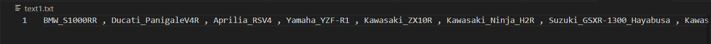
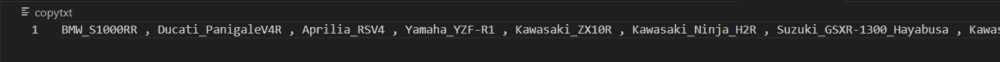

# Copy-File
## AIM:
To write a python program for copying the contents from one file to another file.
## EQUIPEMENT'S REQUIRED: 
PC
Anaconda - Python 3.7
## ALGORITHM: 
### Step 1:
Create a text file with some content in it.
### Step 2: 
Open the created text file.
### Step 3: 
Create another empty text file.
### Step 4:  
Copy the content of text file to empty file using write function.

## PROGRAM:
```python
#Developed by: Nithilan s
#Register Number: 212223240108
with open("text1.txt","r") as fp:
    msg1=fp.read()
with open("copytxt","w") as fp1:
    fp1.write(msg1)
```
### OUTPUT:



## RESULT:
Thus the program is written to copy the contents from one file to another file.
